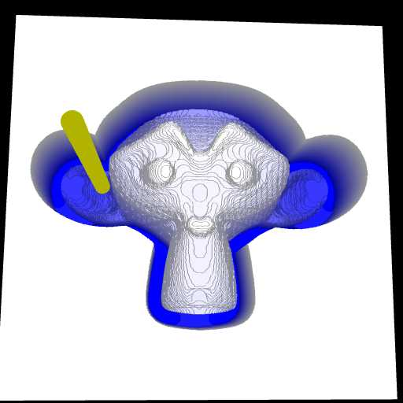

# Lightweight 3-Axis CNC G-Code Simulator

## [CLICK HERE TO TRY NOW!](https://harvie.github.io/cnc-simulator)

### Origins
This simulator was part of [JSCut](https://jscut.org/) discontinued CAM package which was developed since 2014 by [Todd Fleming](https://github.com/tbfleming/jscut).

During 2024-09 it was isolated and modified to be useful in offline/standalone context by [Tomas Mudrunka](https://github.com/harvie).

Similar project used to be available since 2016-05 at www.cncwebtools.com/Apps/GCode_Simulator/index.html but features were limited and the website is defunct since 2020-08.

### Features
 * Load g-code from file
 * Pass settings and G-Code via URL
 * Support for arcs (G02, G03, IJ only)
 * Animation
 * Works offline (no webserver needed)
 * V-Carving

### TODO
 * After calling simulate() the old instance is stuck somewhere while the new one is created. Probably GL context not cleaned up properly...
 * Visualize origin point
 * Figure out why viewport is always square (cannot properly fill non-square rectangles)
 * 3D view zooming and translating
 * Support for mm/inch (bit settings and G21, G20)
 * Support for ball nose and radiused milling bits
 * Tool library and toolchanges (eg. T1 M6)

### See also
 * https://camotics.org/
 * https://github.com/vlachoudis/bCNC
 * https://github.com/LaserWeb/LaserWeb4
 * https://harvie.github.io/cnc-simulator
 * https://raw.githack.com/Harvie/cnc-simulator/master/index.html
